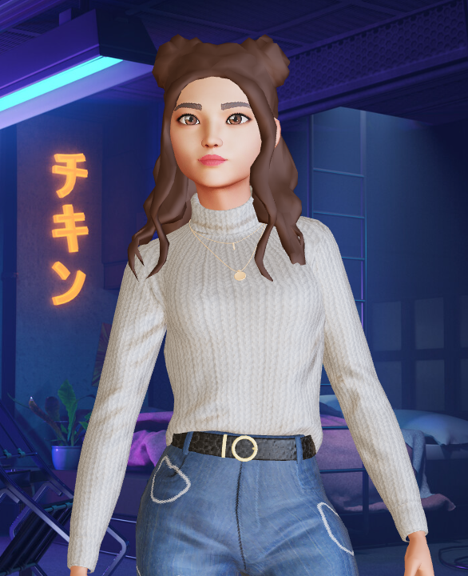

# 🤖 ava - A Virtual Assistant&nbsp;&nbsp;&nbsp;&nbsp;&nbsp;&nbsp;&nbsp;

🤖 ava is your virtual assistant powered by Open-Sources AI Models and carried by [Ollama]().  
ava is one of the first artificial intelligences with a face, eyes, ears and mouth, she can help you with  
any task, just ask her a question and she'll answer.

This is a personnal project which will probably improved regularly on my free time.  
It's future is to be totally open-source and free to use for everyone who wants to use it.

Thanks to [Ollama](), [Hugging Face](), [Ready Player Me]() their amazing work who helped me bring this project to life.

- This project is currently **under development** and is not ready for production use. 🏗️

  
  
  

## 📖 Table of Contents

- [🤖 ava - A Virtual Assistant       ](#-ava---a-virtual-assistant)
  - [📖 Table of Contents](#-table-of-contents)
  - [🛠️ Prerequisites](#️-prerequisites)
  - [📦 Installation](#-installation)
  - [🎨 Features](#-features)

## 🛠️ Prerequisites

`🏗️ Work in progress.`

## 📦 Installation

`🏗️ Work in progress.`

## 🎨 Features

- **Speech recognition**
  - OpenAI Whisper (Local) *⚡Need a good GPU for large model, good CPU for small model*
- **Text-to-speech**
  - System TTS (pyttsx3) *🏗️ Work in progress*
  - Eleven Labs (External API) *🔐 Need an API Token*
  - Bark AI (Local) *🏗️ Work in progress*
- **Text generation**
  - Ollama Server (Local API) *⚡Can run on multiple devices depending on the model*²